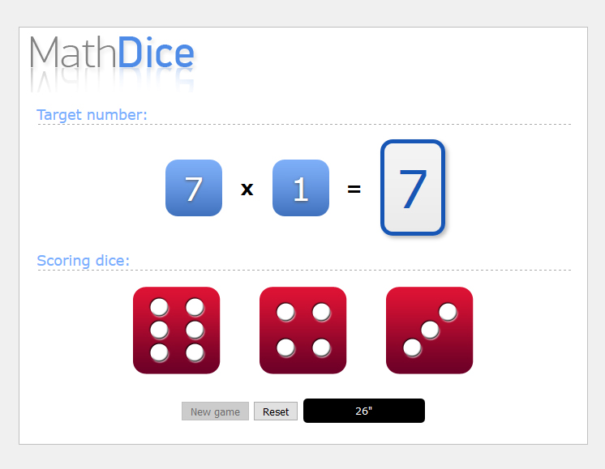
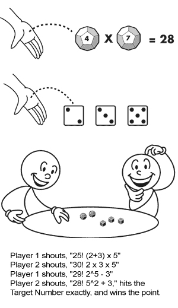

# MathDice
A simple approach of the famous game from Thinkfun, Math Dice! Try it online at codepen: [http://codepen.io/tgogos/full/yVoyzv/](http://codepen.io/tgogos/full/yVoyzv/)

## Preview

## How to play - rules
 1. To start, one player rolls the two 12-sided dice. A “Target Number” is then established as the result of multiplying these two numbers together.
 2. After the Target Number has been established, the other player rolls the three 6-sided “Scoring” dice. Using each of the numbers on the dice once and only once, and combining them using any combination of addition, subtraction, multiplication, division, and/or powers, players attempt to calculate a result that comes as close as possible to the target. In the case of powers, your must use one or more of the scoring numbers to get your exponent.
 3. Once a player has calculated a number, she calls it out. The other player then tries to find a closer number. Players go back and forth until one player either hits the target exactly or the other player cannot find a closer number.
 4. The player who calculates the closest number wins the point. The winning result may be above the Target Number, below the Target Number, or may hit it exactly.
 
## Example

